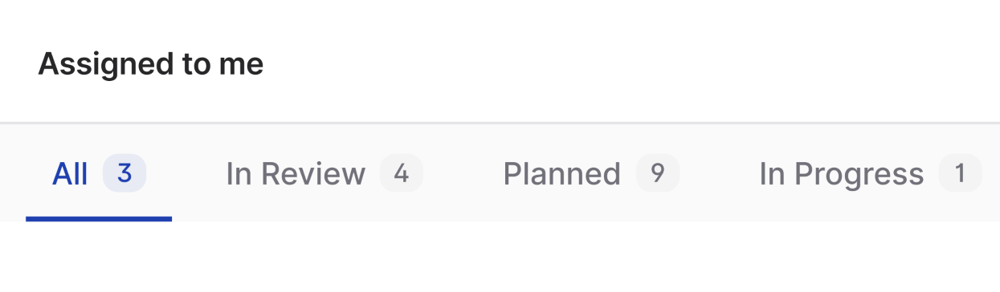
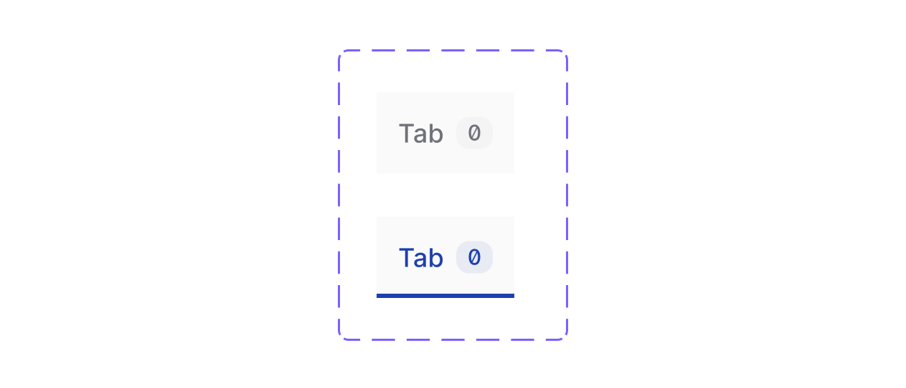
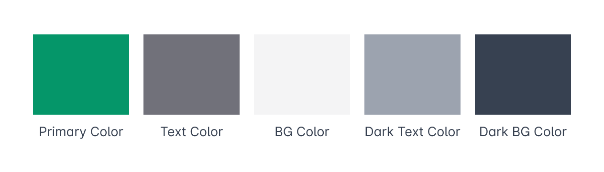
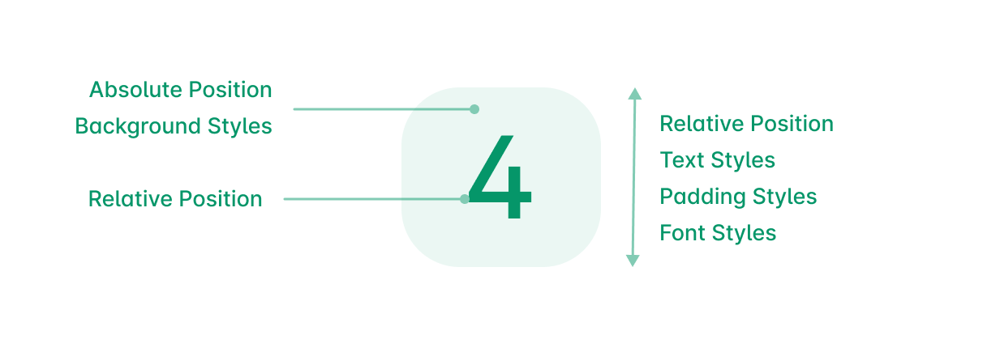
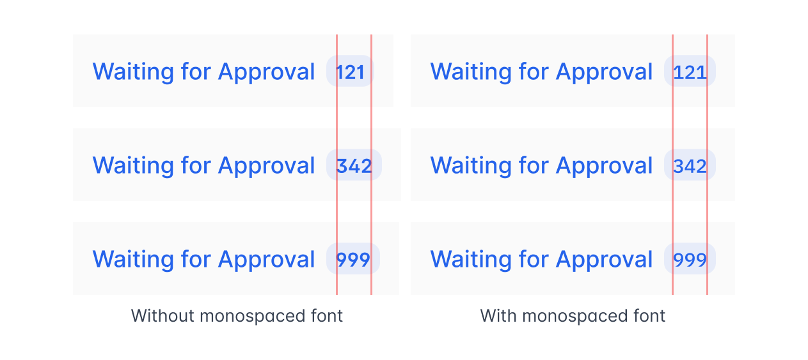

A number badge is just as it sounds, a number shown in a badge like UI. In our case, we are showing a badge next to the tab names that shows the number of posts in a particular view. Let’s go through the process of developing a UI for it.



## Design

There are lot of ways to denote this type of UI to the user, here are some of the early ideas I had.


Displaying the number right next to the tab names seemed a little off as it’s easy to read it as a continuous text with the tab name.

I decided that the last idea would be a better solution overall. As it’s easy to understand with the context of the tab name and it has really distinctive active states, it’s easier for people to glance at it while scrolling through it and know how many items are in the current list.

As we decided on how the UI is going to look, let’s create the needed figma component for it. We have two variants here, the active and normal state. Let’s make use of figma’s variants feature and create it.



We also have different themes that people can choose and a dark mode. As our solution is not that complicated, it will easily adapt to those scenarios too.


## HTML and CSS Design

Now, it’s time to create the component in code, let’s take the green theme for example. We are going to use TailwindCSS to make these components.

```html
<span
  class="text-gray-500 bg-gray-100 py-px px-1.5 rounded-full font-mono text-xs font-medium inline-flex"
  >4</span
>
```

The code above will create the following UI. It has text, background and padding on the same element which works for the following normal badge variant.


But a problem comes when we go to the active variant. Here is all the colors we have:



The primary color is the color that is selected by the user so don’t have a light version of the color for the active badge’s background.

Now, we have to reduce the primary color’s opacity to denote that there is a brand background on the number badge.

For this, we have to add a decoration component inside the number badge so that it will have primary color as it’s background with reduced opacity.



The wrapping `span` will have relative position so that we can have an absolute positioned empty background `span` inside it. The order also matters here, inside the wrapper span, the background should come first and then the number `span` should come which is also relatively positioned.

```html
<span
  class="text-primary ml-1 py-px px-1.5 rounded-full font-mono text-xs font-medium inline-flex relative transition"
>
  <span
    aria-hidden="true"
    class="bg-primary opacity-5 absolute inset-0 rounded-full select-none transition"
  ></span>
  <span class="relative">393</span>
</span>
```

This way we can easily add opacity to the background alone and we don’t need another color here to depict the light primary background color.

## React Component

TailwindCSS needs to have the full class names present in our files to generate those css, so we need to have some decider functions that will help us set our variant colors.

```jsx
import clsx from "clsx";

export default function NumberBadge({ number = "", variant = "light" }) {
  const setTextColor = (color) => {
    if (color === "primary") return "text-primary";
    if (color === "light") return "text-gray-600";
    if (color === "white") return "text-gray-600";
    return "text-gray-600";
  };

  const setBackgroundColor = (color) => {
    if (color === "primary") return "bg-primary opacity-5";
    if (color === "light") return "bg-gray-100";
    if (color === "white") return "bg-white border border-gray-200";
    return "bg-gray-100";
  };

  return (
    <span
      className={clsx(
        setTextColor(variant),
        "ml-1 py-px px-1.5 rounded-full font-mono text-xs font-medium inline-flex relative transition"
      )}
    >
      <span
        aria-hidden="true"
        className={clsx(
          setBackgroundColor(variant),
          "absolute inset-0 rounded-full select-none transition"
        )}
      />
      <span className="relative">{number}</span>
    </span>
  );
}
```

`setBackgroundColor` and `setTextColor` here will decide the color class names based on the variant that is passed through the component’s props.

Then you can use the NumberBadge component in your code.

```jsx
<NumberBadge number="5" variant="light" />
```

---

Another small optimization is to use monospace font for the number so that it won’t move the layout when the number is dynamically updated.


