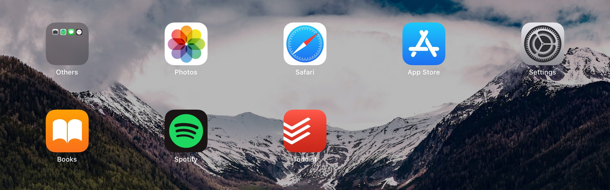

The major takeaway for me was his call to join the attention resistance movement.

I, like most people, have no self control to read a book if I have the opportunity to watch Netflix. So I use the following techniques to trick my brain into doing what I want even when I don't want it.

## Set purpose for each device

**Phone:**

- Talking, Messaging to Friends
- Listening to Music and Podcasts
- Manage Todo List

**iPad:**

- Netflix, Music, Podcasts
- Reading Books

**MacBook:**

- Work (Design, Develop, Meetings, Mail)
- Music
- Browsing
- Video Editing
- Manage Todo List, Notes

**PC:**

- Gaming

## Remove all the other unneeded apps

After I set the main purpose for each device, I got into removing all the other cruft apps that I didn't need.

### Phone

I ended up with total of 8 essential apps on my phone. I have rooted my phone, so I could remove Play Store and other unneeded apps. I installed third party apps with APK from trusted sources which I manually update once a month.

### iPad

iPad is my main entertainment device, but most of this occurs in the browser. I haven't found the need to install any apps that are already available in the browser.

### MacBook

As my work device, it has everything I need to get into the flow, attend meetings and collaborate with coworkers.

## Reduce screen time

Already my screen time has reduced a lot, but there are some more steps I followed:

- Turn off all notifications other than the ringer and alarm.
- Leave phone and iPad on set places away from work and bed.
- Consolidate texting.
- Set leisure activities in the real world.

## Where I can improve on

As I gain time from other reducing other apps, I seem to spend even more time on Video Games. This might be due to the quarantine but I am spending a lot of time on it now.

I also observed I seem to be happy after playing games for 30 mins to an hour. And miserable if I play for more than 4 hours a day.

So that's my next target, play games for an hour a day and then move on to the next thing.

## Next Steps

Here are some steps that Cal Newport suggests that I intend to do more of:

- Be bored on purpose
- Be alone with my thoughts
- Embrace slow media
- Take long walks
- Let go of the fear of missing out
