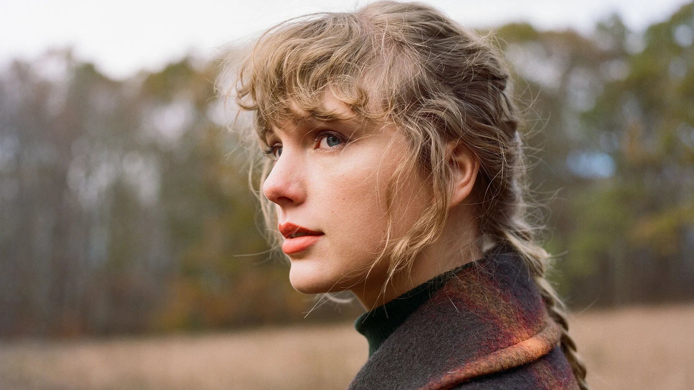

## The Unique Charm of Folklore

1. **A Shift from the Norm**: Taylor Swift, who we all know for her catchy pop tunes and personal stories, took a different route with "Folklore." This album isn't just about her life; it's a mix of made-up stories and a few personal touches. It's like she's telling us tales from a magical forest in her mind.

2. **Lyrical Genius**: Taylor's always been great with words, but "Folklore" takes it to another level. The lyrics are like vivid stories - from tales of wild adventures to the raw emotions of doctors during the pandemic. It's storytelling at its best.

3. **Cottagecore Vibes**: The album gives off this 'cottage in the woods' feel. It's all about finding peace in nature, something we all longed for when stuck indoors during the lockdowns. Taylor uses this to express her need for escape - from the pandemic chaos and the pressures of fame.

## Narrative Craftsmanship

Swift's decision to craft stories beyond her personal experiences adds depth and diversity to the album. This approach highlights her skill as a storyteller, weaving narratives that, while not autobiographical, are deeply influenced by her perspectives and experiences​​.

## The Atmosphere of "Folklore"

From the very first listen, "Folklore" felt like stepping into a misty, otherworldly forest. The album's overall tone was melancholic yet soothing, interspersed with moments of profound introspection and emotional rawness. Each track contributed to a cohesive narrative, creating an experience that was both deeply personal and universally relatable.

## Let's dive into each song and the emotions they evoke in me.

**The Curtain Rises: "the 1"**

As the opening chords of "the 1" played, I was immediately transported to a world tinged with the soft light of nostalgia. The song’s reflective lyrics about lost love and what-ifs, combined with its mellow melody, set the tone for the album. It's like sitting by a window on a rainy day, lost in thoughts of what could have been.

**Echoes of the Past: "cardigan" and "the last great american dynasty"**

"cardigan" took me on a journey through the complexities of a mature love. Its haunting melody, layered with rich, poetic lyrics, felt like a warm, familiar embrace. Then, "the last great american dynasty" unfolded a story that was not mine but felt strangely personal. Swift's storytelling prowess shone through, painting vivid pictures with her words.

**The Heart of the Album: "exile" and "my tears ricochet"**

"exile," a duet with Bon Iver, struck a chord with its portrayal of a failed relationship. The contrast between Swift’s and Bon Iver’s voices added depth to the narrative of miscommunication and regret. Following this, "my tears ricochet" was a raw, emotional experience. Its haunting melody and lyrics about betrayal and loss resonated deeply, as if echoing the pain of every broken heart.

**A Soothing Balm: "mirrorball" and "seven"**

"mirrorball" shimmered with a vulnerability, a soft confession of one’s desire to be loved and seen. It was like watching light dance off a disco ball in a dimly lit room – mesmerizing and a little melancholic. In "seven," there was a return to innocence, a reminiscence of childhood friendships and simplicity, offering a soothing balm to the album’s earlier intensity.

**Reflective Moments: "august" and "this is me trying"**

"august" felt like a fleeting summer romance, full of longing and wistfulness. Its airy melody carried the bittersweet tang of memories best left untouched. "this is me trying" was a raw acknowledgment of effort and struggle, a poignant reminder of the strength it takes to keep going.

**The Twilight of the Album: "illicit affairs" and "invisible string"**

"illicit affairs" was a journey into the complexities of forbidden love, its hushed tones and vivid imagery creating an intimate atmosphere. "invisible string," on the other hand, offered a sense of serendipity and connection, a reminder that life’s tapestry is intricately woven with threads of fate.

**The Final Act: "mad woman," "epiphany," and "betty"**

"mad woman" was a fiery expression of anger and defiance, a striking contrast to the album’s earlier tranquility. In "epiphany," there was a shift to a more somber tone, a reflection on the fragility of life. Finally, "betty" brought a sense of closure, a return to the roots with its more traditional narrative structure and harmonica-infused melody.

**The Encore: "peace" and "hoax"**

As the album neared its end, "peace" offered a raw, honest confession of one’s imperfections in love. And finally, "hoax" was like the last brushstroke on a canvas, a melancholic yet beautiful end to a masterful album.

## Final Thoughts

"Folklore" by Taylor Swift is more than just an album; it's a journey through the human experience. Each track is a chapter in a larger story, one of love, loss, and the bittersweet taste of life. Swift has crafted an album that resonates on a deeply personal level, inviting listeners to find pieces of their own stories within her songs. As the final notes faded, I was left with a sense of having been part of something truly magical.
