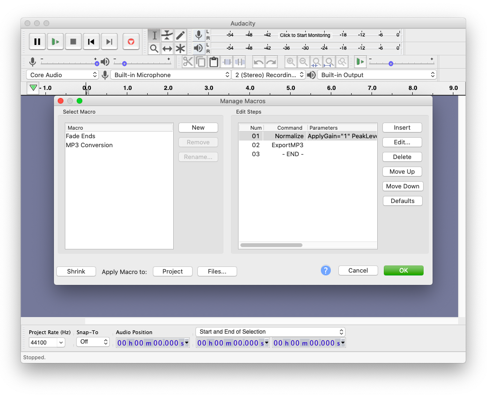
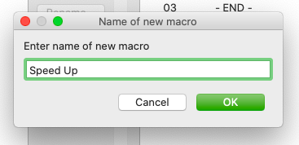
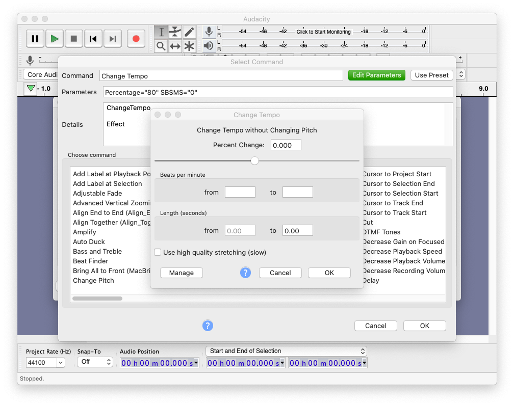
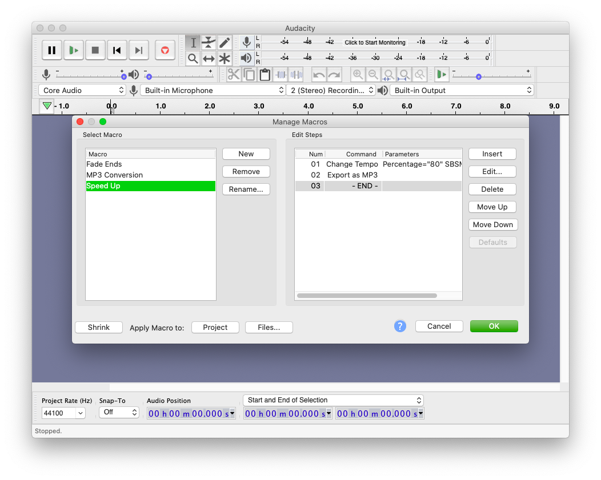
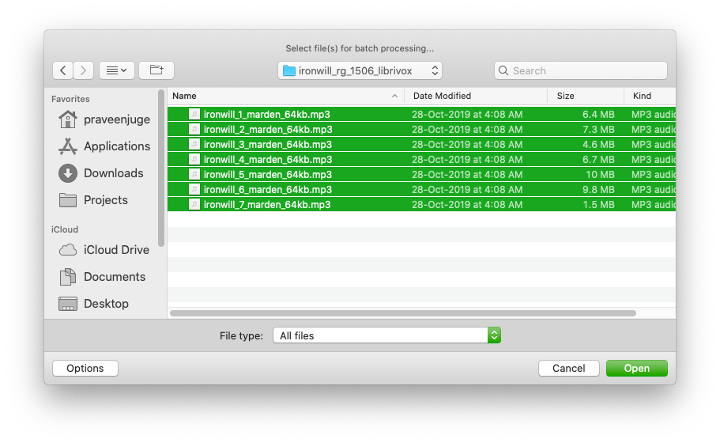
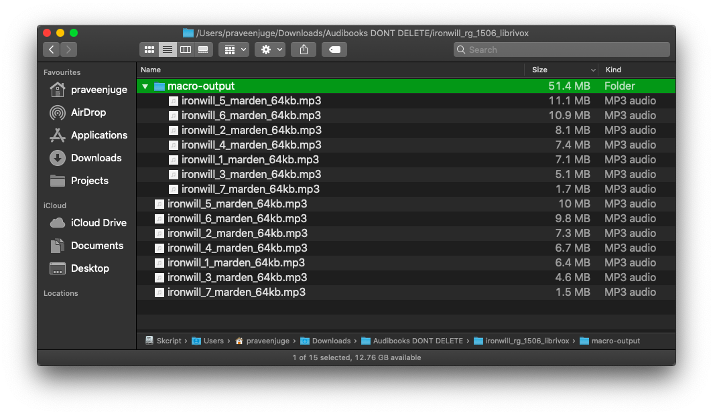

### Step 1: Download or Update Audacity

You can download the latest version of Audacity [here](https://www.audacityteam.org/download/). Make sure it's the latest version, I'm on a mac and at the time of writing this the latest version is `2.3.2`

### Step 2: Open Macros in Audacity

Once you open audacity you can go to `Tools -> Macros...` to open this window.

Click on `New` to create a new macro and give a new name to your macro.

### Step 3: Add steps to your macro

On the edit steps pane, click on the `Insert` button. You will see another window where you can add the steps to be taken when this macro runs.

In our case, we need to speed up our audiobooks. Now you will see the option to change speed, don't use that unless you want to hear chipmunks. Use the `Change Tempo` option and click on edit parameters in the same window.

Here you can increase the percentage to match with the speed you want, for `1.5x` speed of the original audio, increase the percentage to `50`, for `2.0x` change percentage to `100`. Then click on ok, you can see the step added.

By doing this, it won't get saved anywhere, so let's add another step. Click on insert and find the `Export as MP3` step. This will make sure the contents would be exported.

### Step 4: Let's convert

If all goes well you should see something like this:

Now click on `Apply Macro to: Files` button below and select the files you want to convert.

When you open the files the macro would start to run and after completion, you will see the converted files in the same origin folder under a new folder name called `macro-output`.

Make sure you save the macro for future use. That's all, enjoy!
