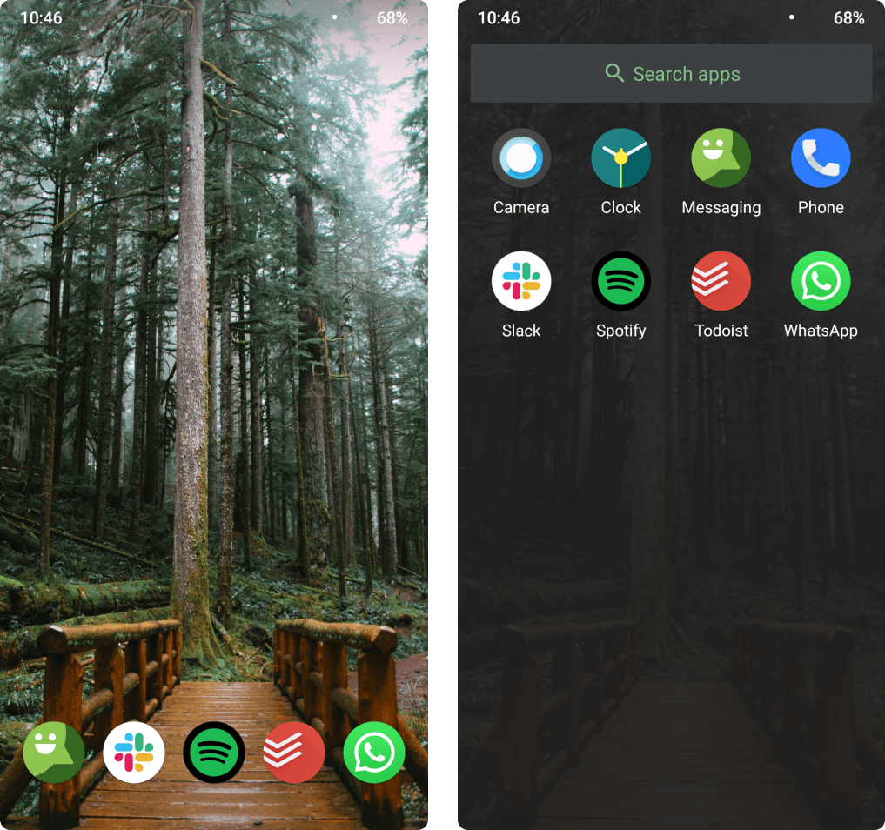
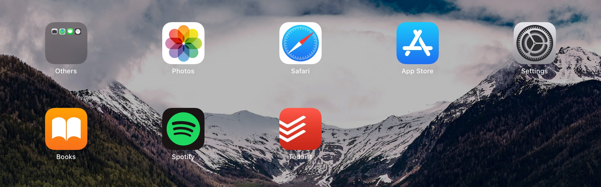
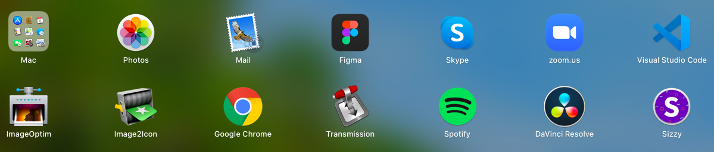

The major takeaway for me was Cal Newport’s call to join the attention resistance movement.

Like most people, I don’t have the self-control to read a book if I have the opportunity to watch Netflix. So I use the following techniques to trick my brain into doing what I want even when I don’t want to do it.

## Set a list of purposes for each device

**Phone:**

- Talking, Messaging to Friends
- Listening to Music and Podcasts
- Manage Todo List

**iPad:**

- Netflix, Music, Podcasts
- Reading Books

**MacBook:**

- Work (Design, Develop, Meetings, Mail)
- Music
- Browsing
- Video Editing
- Manage Todo List, Notes

**PC:**

- Gaming

## Remove all the other unneeded apps

After I set the main purpose for each device, I got into removing all the other cruft apps that I didn’t need.

### Phone

I ended up with a total of 8 essential apps on my phone. I have rooted my phone, so I could remove Play Store and other unneeded apps. I installed third-party apps with APK from trusted sources which I manually update once a month.

### iPad

iPad is my main entertainment device. Apart from some, I didn’t have the need to install apps that are already available in the browser.

### MacBook

As my work device, it has everything I need to get into a flow, attend meetings, and collaborate with my coworkers.

## Reduce screen time

Already my screen time has reduced a lot, but here are more steps I followed:

- Turn off all notifications other than the ringer and alarm.
- Keep your phone and iPad away from your work desk and bed.
- Consolidate texting.
- Set leisure activities in the real world.

## Where I can improve on

Though I gain more time every day by getting rid of unnecessary apps, I seem to be spending a lot of time on video games lately which might be an effect of quarantine.

I also observed that playing games for 30 mins to an hour makes me happy. And playing for more than 4 hours a day makes me miserable.

So that's my next target. Play games for an hour a day and then move on to the next thing.

## Next Steps

Here are some steps that Cal Newport suggests which I intend to do more of:

- Be bored on purpose
- Be alone with my thoughts
- Embrace slow media
- Take long walks
- Let go of the fear of missing out
