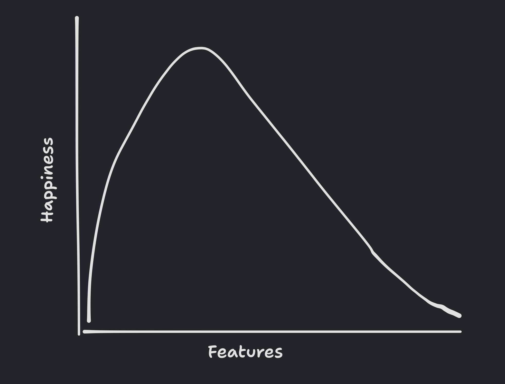

Initially, a product's simple and intuitive nature draws people in. However, as features are added, complexity creeps in, and the essence of simplicity can be lost.

This complexity often leads people back to seek simpler alternatives.

The lesson for designers is clear: maintain simplicity at the core of design.

But people want more features all the time. It's crucial to regularly step back and view the product, asking if the added features enhance or hinder the experience.

How would you decide what feature to add next?
