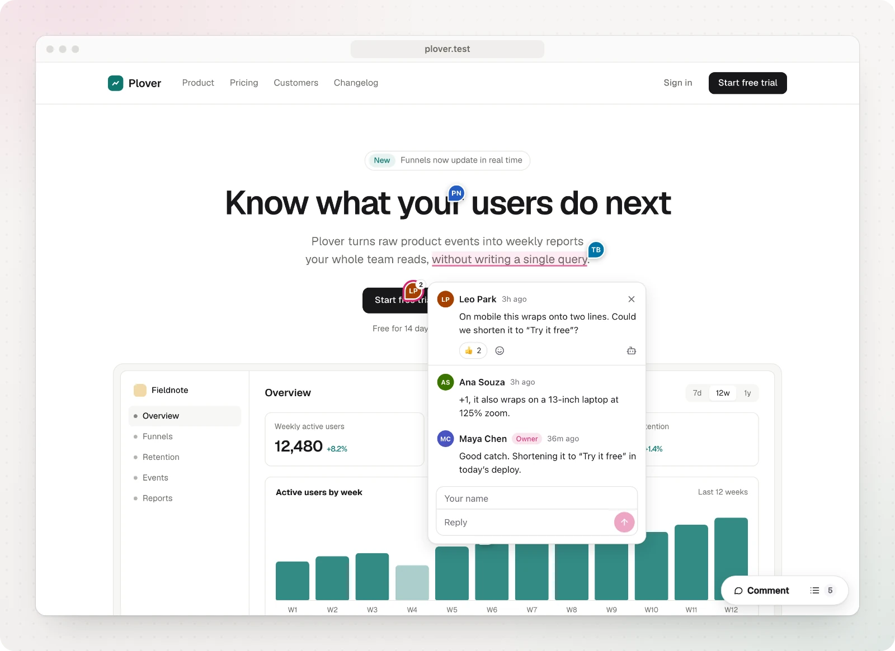
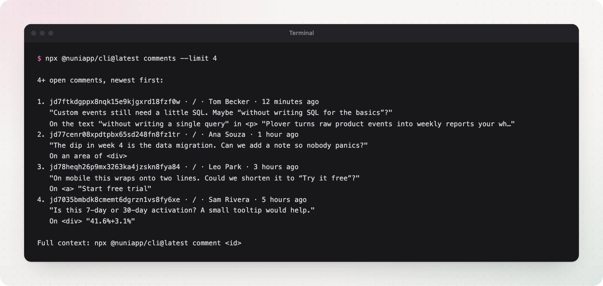

Website feedback usually arrives as a screenshot. A red circle. "This button feels off." Then someone has to find which button, on which page, at which screen size.

In Figma I just click the thing and comment. I wanted that on the real site.

So I built [Nuni](https://nuni.praveenjuge.com).



## Comment on the real thing

Add Nuni to your site and anyone who can open it can leave a comment. Press <kbd>C</kbd>, click anything, write. The pin shows up for everyone, live.

- No accounts for commenters. They type a name and go.
- No API keys. One public project ID in your code.
- Works on localhost, preview URLs, staging and production.

You can also select a few words or drag a box over part of a chart. Replies, reactions, resolve and reopen are all there.

Comments are matched by page path, not domain. A comment left on localhost also shows on the preview deploy and in production.

## Pins that stay put

This was the hard part. A comment is only useful if it is still on the right element after the next deploy.

Nuni stores several ways to find the element again: stable ids and test ids, its text, nearby headings, its position, and the React component name. Hashed CSS-module classes and Tailwind utilities are ignored. They change between builds and say nothing about identity.

If nothing matches well enough, Nuni does not guess. The comment goes to a "couldn't find on this page" list instead. A pin on the wrong element is worse than no pin.

Every change to the pin engine runs a benchmark of real page changes: copy edits, reordered lists, new wrappers, mobile layouts, web components, iframes. CI fails if fewer than 95% of pins land on the right element.

## Give your agent the context

A comment carries what a coding agent needs: the page, the element, its markup and styles, console errors, failed requests and a screenshot.

Choose **Copy for agent** and paste it into Claude Code, Codex or Cursor. Or add the MCP server once:

```bash
claude mcp add nuni -- npx -y @nuniapp/cli@latest mcp
```

Then ask it to fix the open Nuni comments. It can read them, reply and resolve them with a note about what changed. The same works from the terminal with `npx @nuniapp/cli@latest comments`.



Comment, exact UI context, agent, fix. That's the loop I wanted.

## Try it

Run this in your project:

```bash
npx @nuniapp/cli@latest init
```

It detects your framework and prints the snippet to add. Or copy the prompt from [nuni.praveenjuge.com](https://nuni.praveenjuge.com) and let your agent do it. Then open the panel, choose **Claim Nuni** and sign in with GitHub to own the comments.

It's [open source on GitHub](https://github.com/praveenjuge/nuni).

Add it to something you're building and tell me where the pins break.
