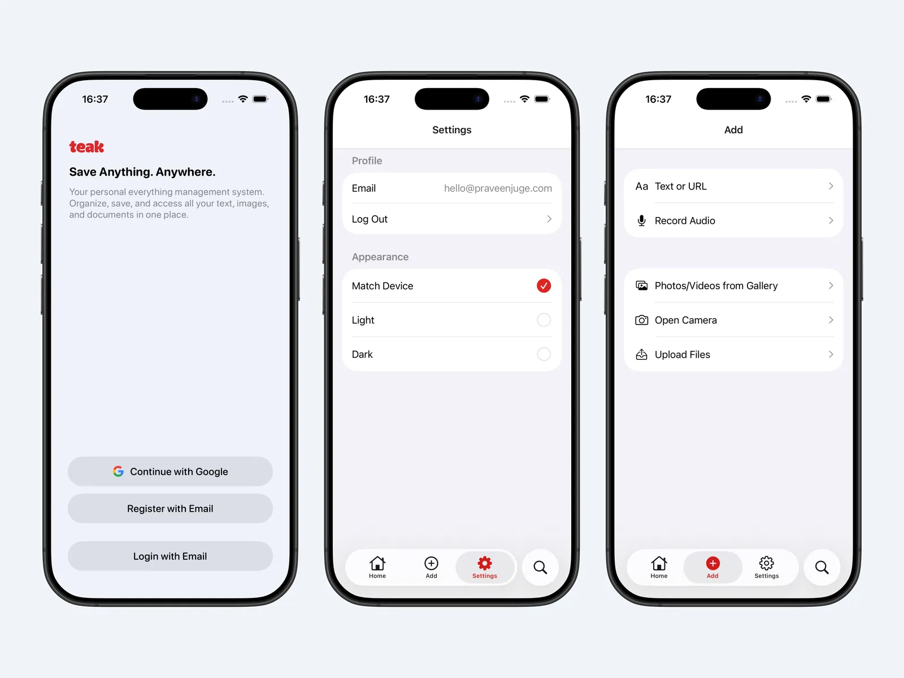
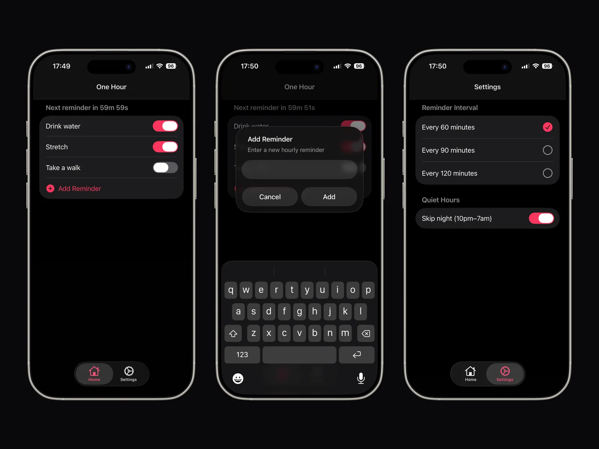
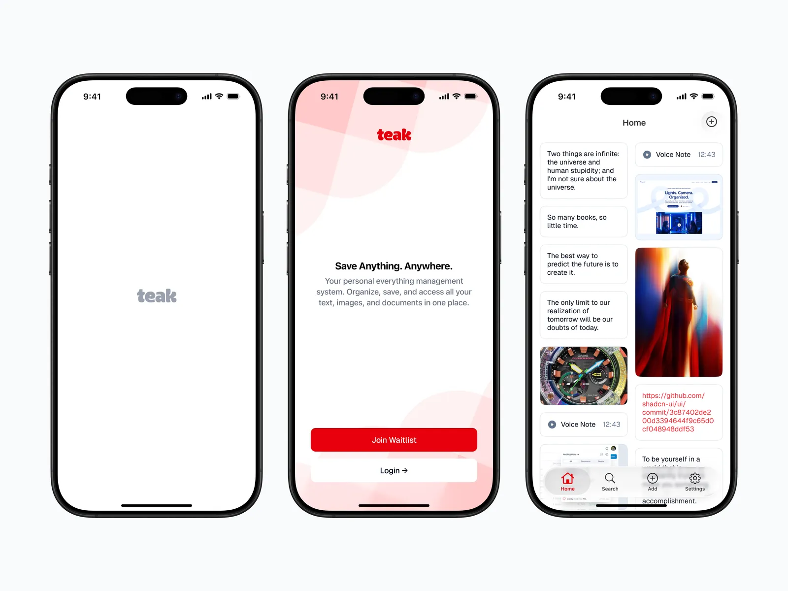
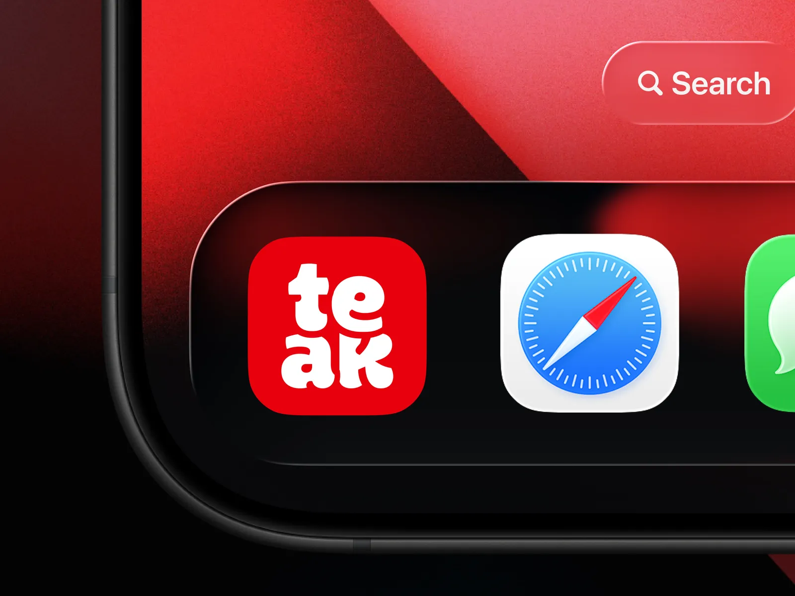

I stopped talking about making iOS apps and shipped three: [**One Hour**](https://apps.apple.com/in/app/one-hour-hourly-reminders/id6756283371), [**Practice**](https://apps.apple.com/in/app/practice-habit-tracker/id6756779057), and [**Teak**](https://apps.apple.com/in/app/teak-save-inspirations/id6756574989).

You can see all three on my [**developer page**](https://apps.apple.com/in/developer/juge-praveen/id1859809495).

Each one started with the same rule: make it **useful**, make it **focused**, and make it **small enough to finish**.

- [**One Hour**](https://apps.apple.com/in/app/one-hour-hourly-reminders/id6756283371) helps me build healthier routines with simple hourly reminders.
- [**Practice**](https://apps.apple.com/in/app/practice-habit-tracker/id6756779057) is my habit tracker for daily streaks and consistency.
- [**Teak**](https://apps.apple.com/in/app/teak-save-inspirations/id6756574989) is my inspiration vault for saving links, images, notes, audio, and documents. It also has its own site at [teakvault.com](https://teakvault.com).

The lesson was not about motivation.

It was about **clarity**.

When I kept the scope tight, the app improved.

When I tried to add too much, the product got blurry.

**Expo** made this whole thing feel possible. I could build fast, test often, and spend my time on the product instead of getting dragged into native setup. And [**@expo/ui**](https://docs.expo.dev/versions/latest/sdk/ui/) helped me ship **real native UI** by letting me build with SwiftUI from React.

**Codex** helped me keep going. It sped up features, helped fix bugs, and gave me momentum when I would normally stall.

Shipping an app is not just code.

It is the **icon**, the **screenshots**, the **copy**, the **privacy details**, and the quiet responsibility of keeping the thing alive after version 1.0.

Getting through App Review is a milestone. **Continuing to improve the app is the job.**

That is my favorite part.

These are not concepts sitting in Figma. They are **real apps** people can download, use, and judge.

I want to make more.
