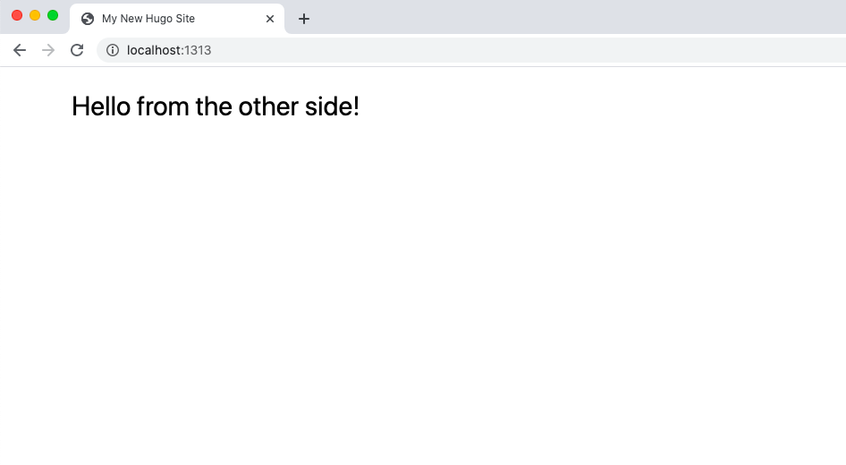

[Just show me the repo](https://github.com/praveenjuge/hugo-tailwind)

Tested on Hugo Version 0.83.1 and Tailwind Version 2.1.2, learn how to [install Hugo here](https://gohugo.io/getting-started/installing/).

## Setup New Hugo Site

Let's create a new empty hugo site to test on:

```sh
hugo new site hugo-tailwind
cd hugo-tailwind
```

Run the above command in your terminal. It will create a new folder called `hugo-tailwind` which will contain your new Hugo site.

Let's create some basic layout files by using the following commands:

```sh
mkdir assets/css layouts/_default

touch layouts/index.html layouts/_default/baseof.html assets/css/main.css
```

In `layouts/_default/baseof.html`, add:

```html
<!DOCTYPE html>
<html>
  <head>
    <title>{{ .Title }}</title>

    {{ $styles := resources.Get "css/main.css" }} {{ $styles = $styles |
    resources.PostCSS (dict "inlineImports" true) }} {{ if hugo.IsProduction }}
    {{ $styles = $styles | minify }} {{ end }}

    <link href="{{ $styles.Permalink }}" rel="stylesheet" />
  </head>

  <body>
    {{ block "main" . }}{{ end }}
  </body>
</html>
```

In `layouts/index.html`, add:

```html
{{ define "main" }}
<h1 class="mx-auto mt-5 text-3xl">Hello from the other side!</h1>
{{ end }}
```

**Now, let's add tailwind.**

## Install Packages

Run the following command in your terminal to add a package.json file and complete the required steps.

```sh
npm init
```

Then install the following packages,

```sh
npm install tailwindcss@latest postcss@latest postcss-cli@latest autoprefixer@latest --save
```

## Tailwind and Postcss Config

In the root folder, run the following code:

```shell
npx tailwindcss init -p
```

This will create a `tailwind.config.js` and `postcss.config.js` file.

For proper purging add the following to your `tailwind.config.js` file:

```js
...
  purge: {
    enabled: process.env.HUGO_ENVIRONMENT === "production",
    content: ["./layouts/**/*.html", "./content/**/*.md", "./content/**/*.html"],
  },
...
```

Next, add the following to `assets/css/main.css` to get the sweet tailwind css on your project.

```css
@tailwind base;
@tailwind components;
@tailwind utilities;
```

Now, if you run `hugo server` in your terminal, you should see this:



That's all, tailwind css is integrated into your hugo site!
