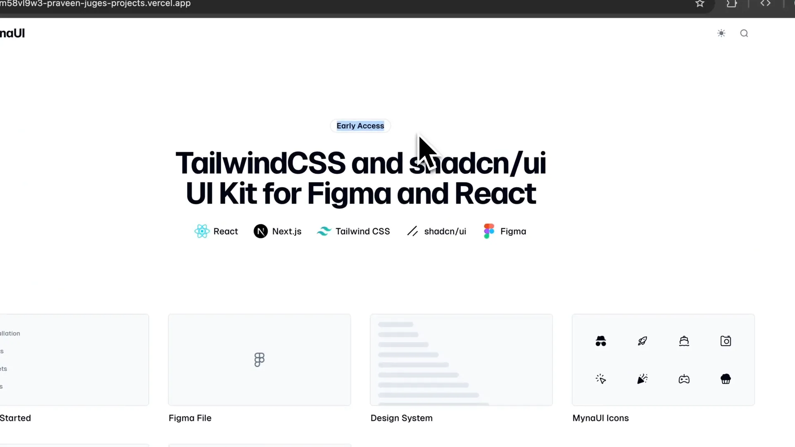
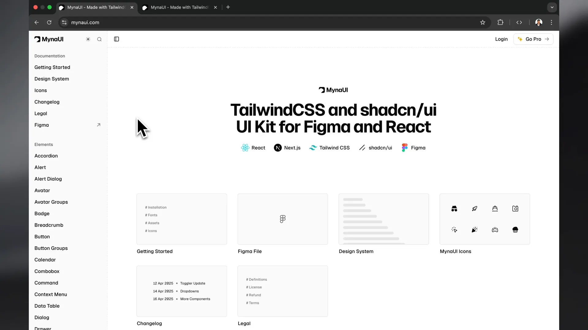
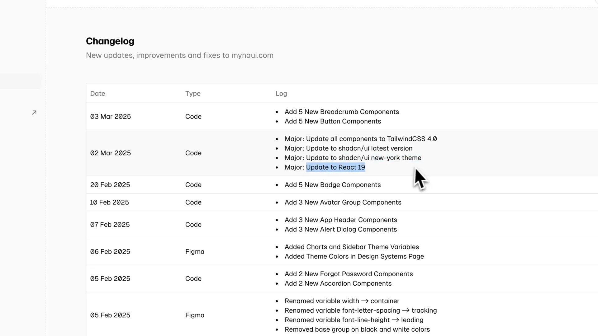
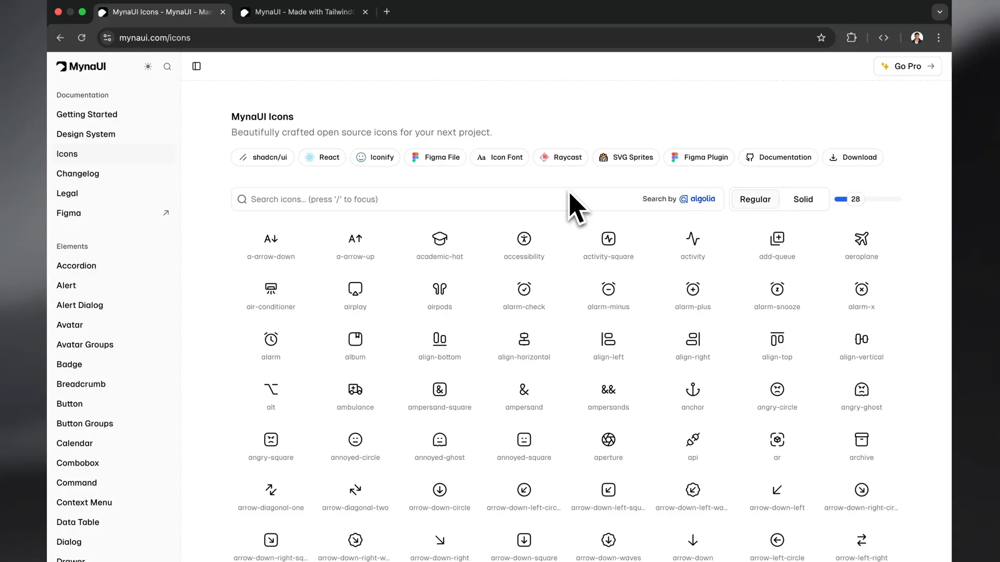
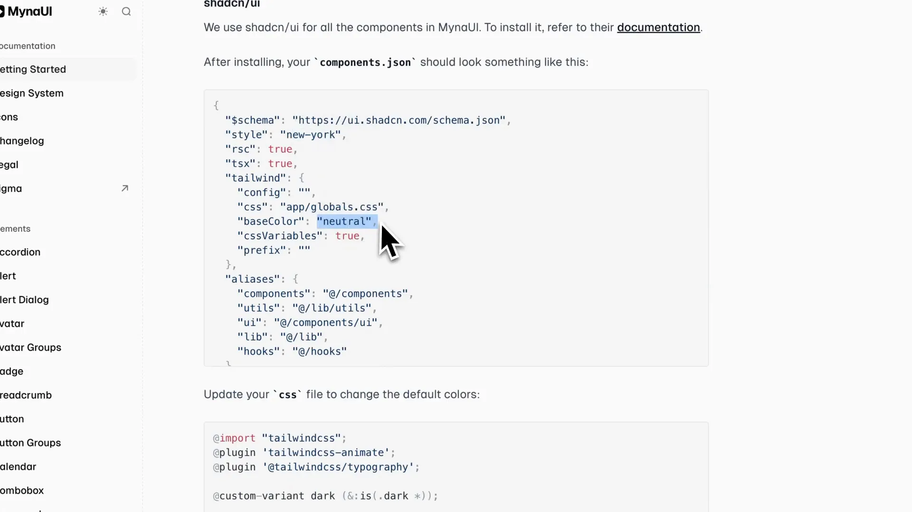
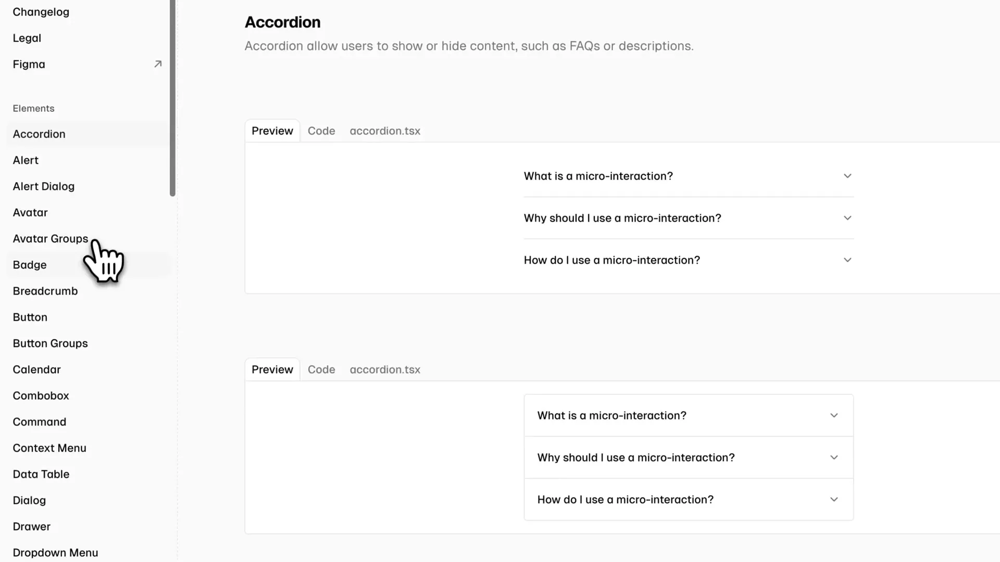

Today, I’m thrilled to share the latest updates to [MynaUI](https://mynaui.com).
If you’ve been following along, you’ll notice some significant changes that
enhance usability and functionality. Let’s dive into what’s new!

### Goodbye Early Access!

[MynaUI](https://mynaui.com) is no longer in early access. I’ve spent a lot of
time refining and adding features, and I believe it’s now fully ready for prime
time. This transition marks a new chapter for [MynaUI](https://mynaui.com), and
I couldn’t be more excited.

### A Fresh Sidebar for Components

One of the major updates is the addition of a sidebar for all components and
elements. This new feature makes navigation easier and more intuitive.

### Moving to Tailwind 4

I’ve updated all components to Tailwind 4, bringing better performance and more
customization options.

### Shifting to the Shad New York Theme

MynaUI now features the Shad New York theme, offering a sleek, modern design
that enhances the interface's look and feel.

### React Updates

MynaUI is updated to the latest version of React, ensuring smooth and efficient
performance.

### New Icons on the Horizon

I’m excited to announce that I’ll be adding a variety of new icons that many of
you have been requesting.

### More Components Coming Soon

After the icons, I’ll be adding more components, focusing on marketing and
application components.

### Visual Changes: A New Color Palette

The updated color palette transitions to a more neutral scheme, aligning with
the Shad New York theme.

### Updated Color System

All colors in MynaUI have been updated to OKLCH for enhanced color accuracy and
consistency.

### New Components to Explore

Several new components have been added, including new badge and button
components.

### Feedback Welcome!

Your feedback is invaluable. Submit requests directly through the platform, and
I’ll do my best to accommodate them.

### Conclusion

That wraps up the latest updates to [MynaUI](https://mynaui.com)! Be sure to
check out the new sidebar, explore the updated components, and keep an eye out
for the upcoming icons and additional features. Have fun experimenting with
[MynaUI](https://mynaui.com), and as always, happy coding!
