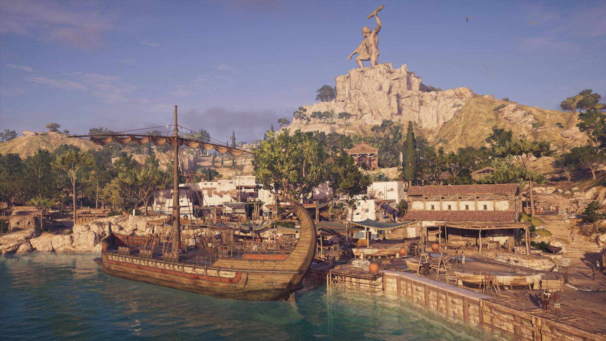
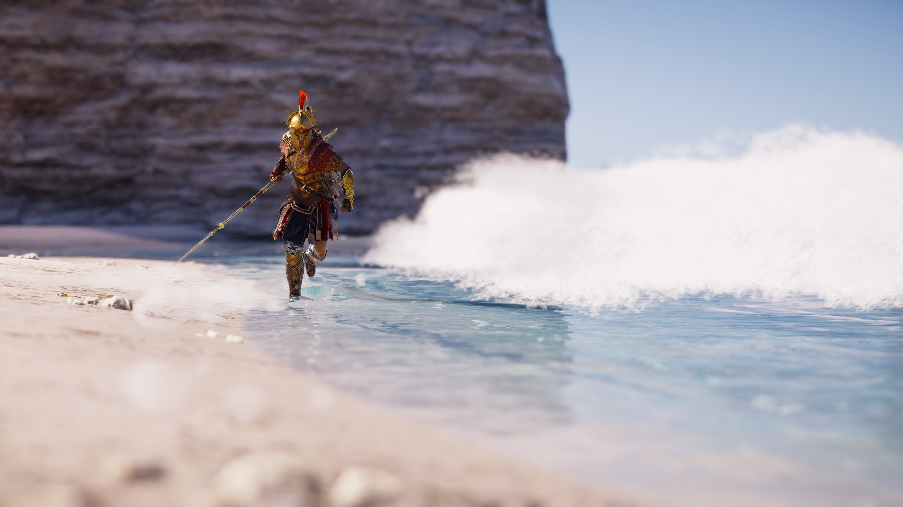
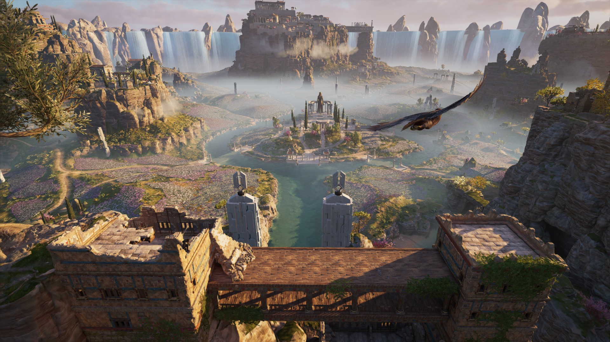
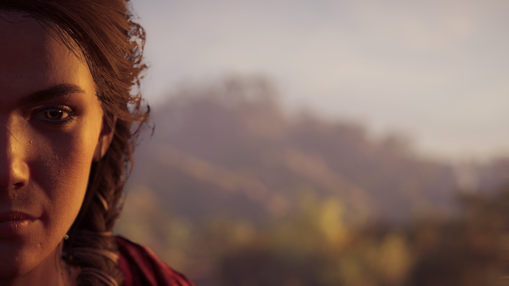
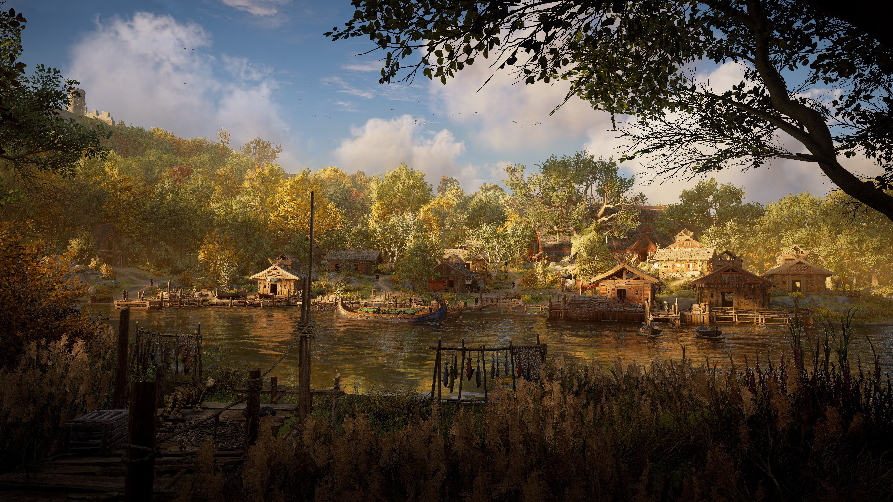
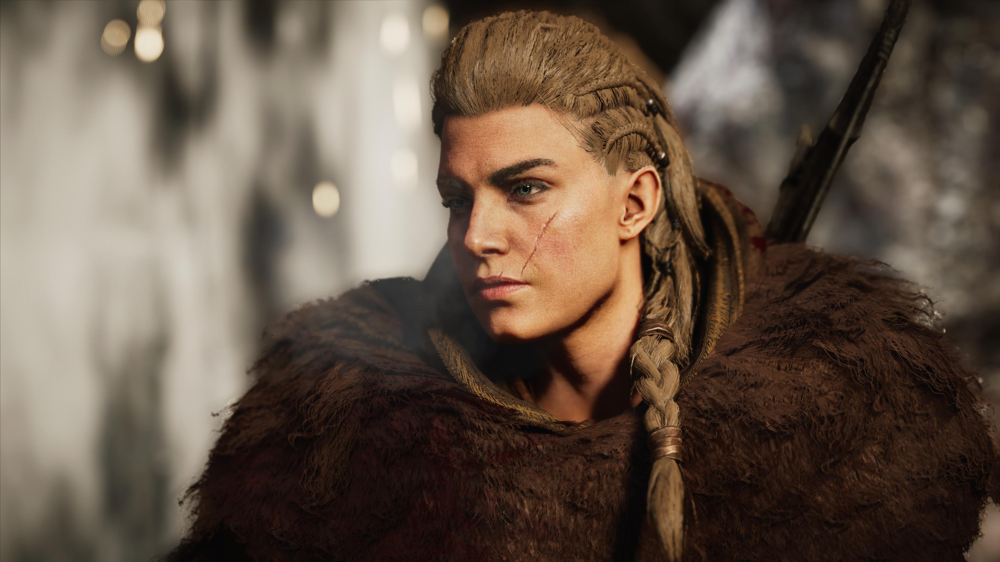
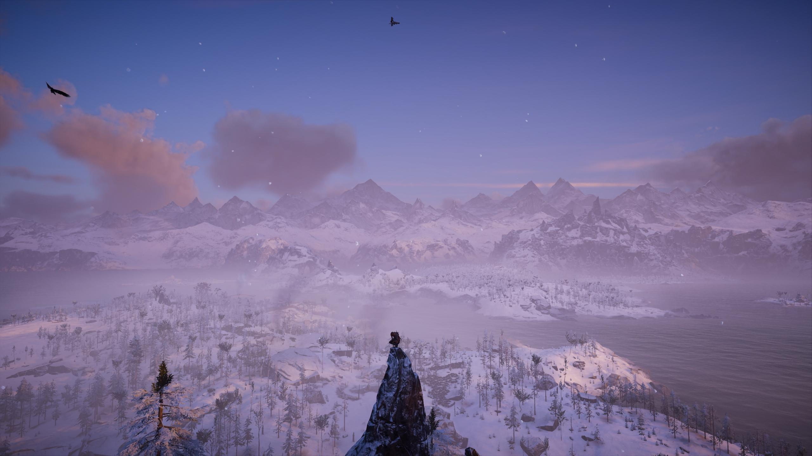
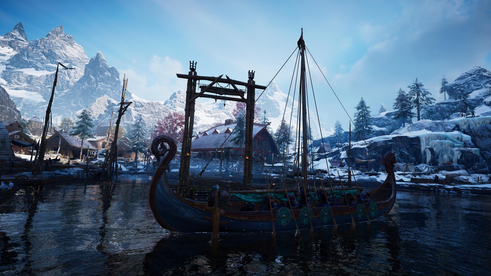
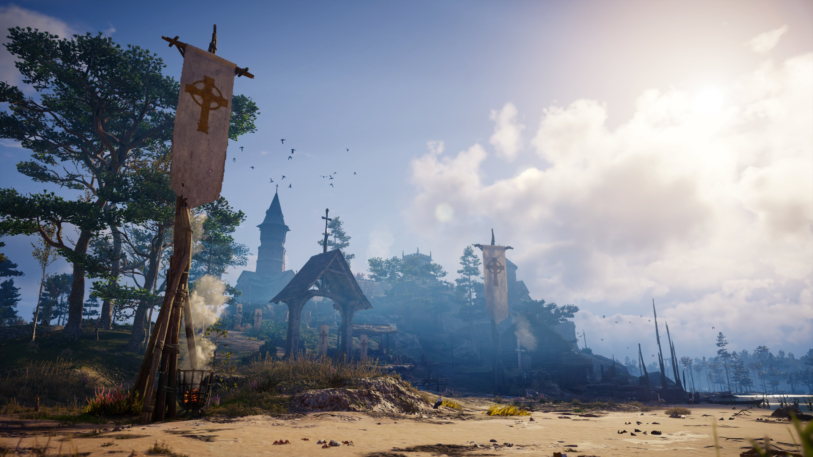

## Assassin's Creed Odyssey

**Setting and Storyline**

Assassin's Creed Odyssey is set in ancient Greece, a setting that is both rich and immersive. The game allows you to step into the shoes of Cassandra (or Alexios, but Cassandra is canonically correct). Cassandra's character is compelling, with her interactions with historical figures and philosophers adding depth to the storyline. The main plot revolves around her journey through Greece, reuniting with her family, and facing numerous challenges.

****

Despite its engaging storyline, some reviews note that the main plot can feel a bit disjointed due to the game's massive scope. The sheer size of the world sometimes detracts from the narrative coherence, whisking players from one end of Greece to the other without much time to develop characters and relationships deeply.

**Gameplay**

The gameplay in Odyssey is engaging, with a variety of activities to keep you occupied. The cultist hunting is a standout feature, providing a sense of mystery and challenge as you uncover and eliminate members of the Cult of Kosmos. The combat system is robust, with a range of abilities and a leveling system that allows for customization and growth. However, the stealth mechanics felt a bit lacking. While stealth is a core aspect of the Assassin's Creed franchise, Odyssey leans more towards direct combat, which might disappoint purists looking for a more traditional stealth experience.

****

Odyssey also introduces a new Mercenary system which adds an extra layer of challenge and excitement to the game. The naval combat, a beloved feature from Black Flag, allows players to engage in epic sea battles.

**Graphics and Sound**

****

One of the most breathtaking aspects of Odyssey is its graphics. The depiction of ancient Greece is stunning, with beautiful landscapes, detailed architecture, and vibrant colors that make exploration a joy. The music complements the setting perfectly, enhancing the atmosphere and immersion.

**Verdict**

As a story-driven gamer, I found Odyssey to be one of the better narratives in the series. Cassandra's arc, the family dynamics, and the rich historical context all come together to create a compelling experience. Despite some shortcomings in stealth, the overall package is impressive. I would rate Assassin's Creed Odyssey a 8 or 9 out of 10.

## Assassin's Creed Valhalla

**Setting and Storyline**

Valhalla takes a different approach, setting the stage in the Viking era. You play as Eivor, a Viking warrior who travels to England to establish a new settlement. The game blends historical and mythical elements, including trips to Asgard and Jotunheim, which, while interesting, sometimes felt out of place.

The story revolves around building alliances across England, with each region offering unique narratives and challenges. However, the mission structure can feel repetitive, with many tasks boiling down to raiding and pillaging, which can get monotonous over time.

**Gameplay**

The gameplay in Valhalla is a mix of traditional Viking raids and Assassin's Creed's stealth mechanics. This combination can feel a bit jarring as the two styles clash. The game's structure revolves around building alliances across England, with each region offering unique stories and challenges. However, the repetition in missions and the overall pacing can be a bit of a drag.

Valhalla does introduce some improvements in stealth mechanics compared to Odyssey, but it still struggles to balance the Viking's brute force with the Assassin's finesse. The combat system is more refined, and the inclusion of settlement building adds a new strategic layer to the gameplay.

**Graphics and Sound**

Valhalla shines in its environmental design. From the snowy landscapes of Norway to the lush fields of England, the game is visually stunning. The sound design is equally impressive, with a score that captures the Viking spirit and enhances the immersion.

**Verdict**

While Valhalla has its moments, it doesn't quite reach the heights of Odyssey for me. The clash between Viking combat and stealth, the repetitive mission structure, and the less compelling story make it less enjoyable. I would rate Assassin's Creed Valhalla around 6 to 7 out of 10.

### Final Thoughts

Both games have their strengths and weaknesses. Odyssey's strong narrative and beautiful setting make it a standout in the series, while Valhalla's immersive Viking world and unique blend of gameplay styles offer a different experience. If you're a fan of story-driven games, Odyssey is the clear winner. However, if you're looking for something different and enjoy the Viking era, Valhalla is worth a try.

Ultimately, both games are worth playing, and they offer hours of entertainment and exploration. Whether you're sailing the Aegean Sea or raiding English monasteries, the worlds of Assassin's Creed Odyssey and Valhalla are rich, immersive, and full of adventure. Highly recommend!
