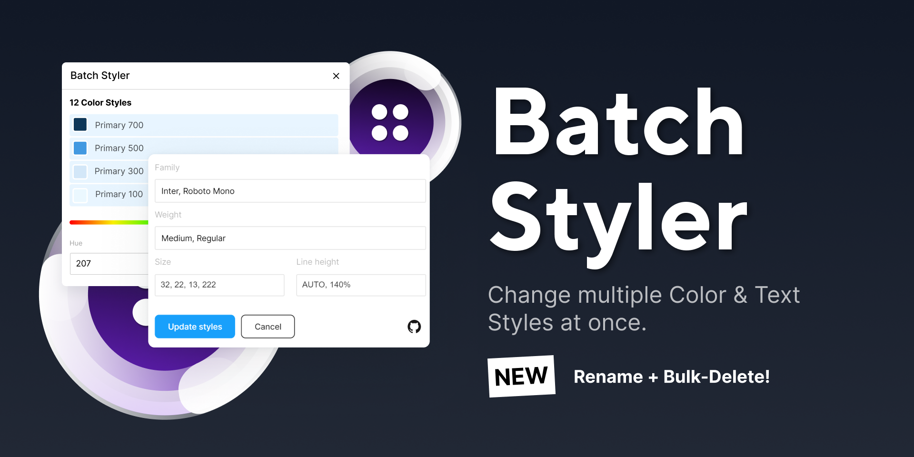
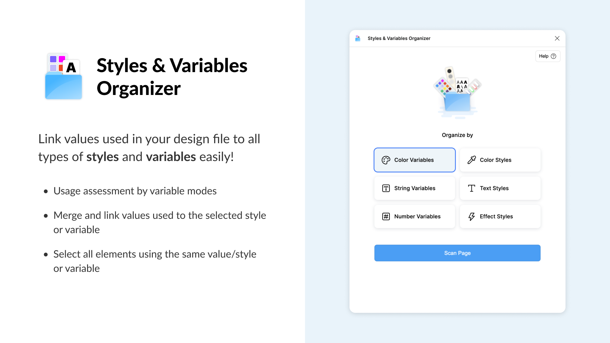
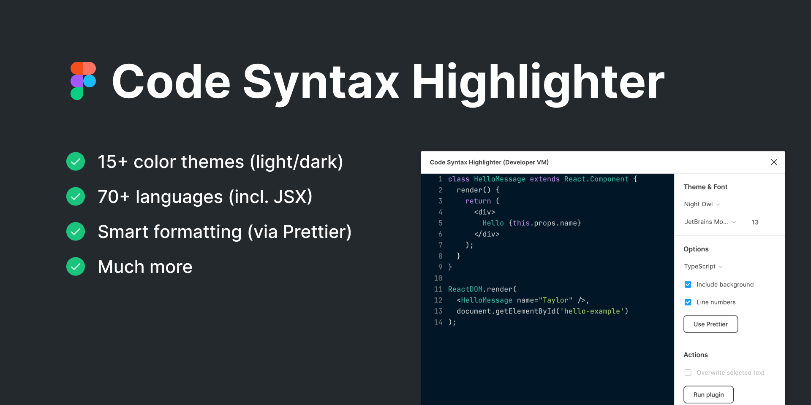
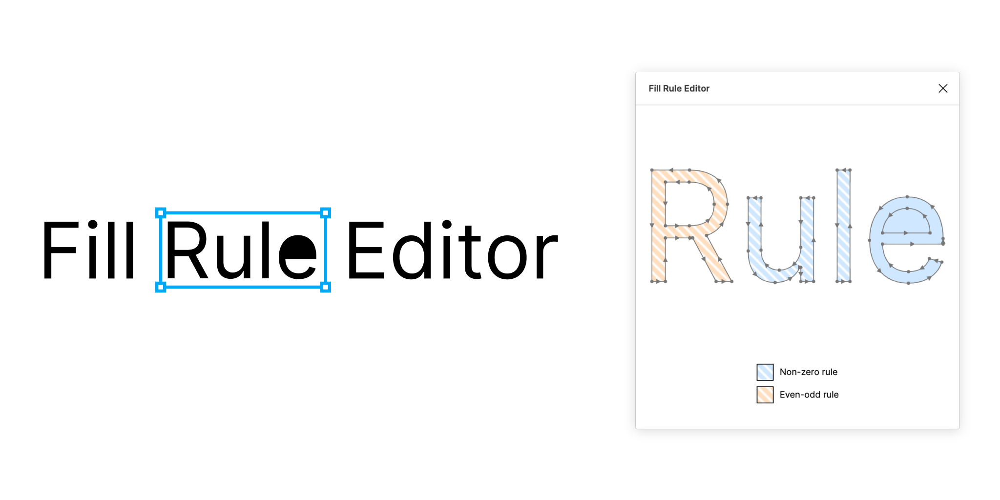
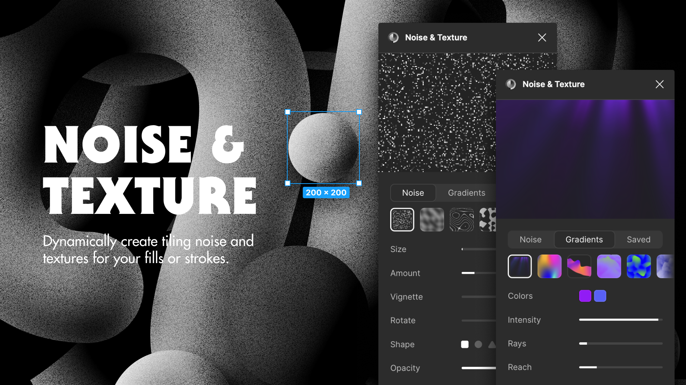

## [Batch Styler](https://www.figma.com/community/plugin/818203235789864127/batch-styler)

If you work with design systems, you need this in your life! I use Batch Styler almost daily, especially for bulk updates to text or color styles. It's perfect when you want to experiment with different typefaces - imagine switching from Inter to Roboto across your entire design system in seconds. Trust me, your future self will thank you.

## [Styles & Variables Organizer](https://www.figma.com/community/plugin/816627069580757929/styles-variables-organizer)

This one's a game-changer for keeping your design system tidy. You know how messy things can get with styles and variables spread everywhere? This plugin helps manage everything in one place. The best part? It automatically finds and links similar values throughout your file - super handy when dealing with those legacy files we all love to hate.

## [Code Syntax Highlighter](https://www.figma.com/community/plugin/938793197191698232/code-syntax-highlighter)

Need to drop some code snippets into your mockups? This plugin is your best friend. It handles pretty much any programming language you throw at it, and switches between light and dark themes like a champ. Makes our developer handoffs look way more professional!

## [Fill Rule Editor](https://www.figma.com/community/plugin/771155994770327940/fill-rule-editor)

If you're into icon work, you'll love this one. It's my go-to for fixing those annoying vector fill issues - you know, when your icons look perfect in Figma but break on export? This plugin lets you switch between fill rules easily, which is a lifesaver for platform-specific exports.

## [Noise & Texture](https://www.figma.com/community/plugin/1138854718618193875/noise-texture)

Last but not least - this plugin is fantastic for adding some subtle texture to your designs. No more jumping between Photoshop and Figma! The real-time preview is super helpful, and it's perfect for those times when you need to add a bit of depth to your work. I use it all the time for background textures and grain effects.
