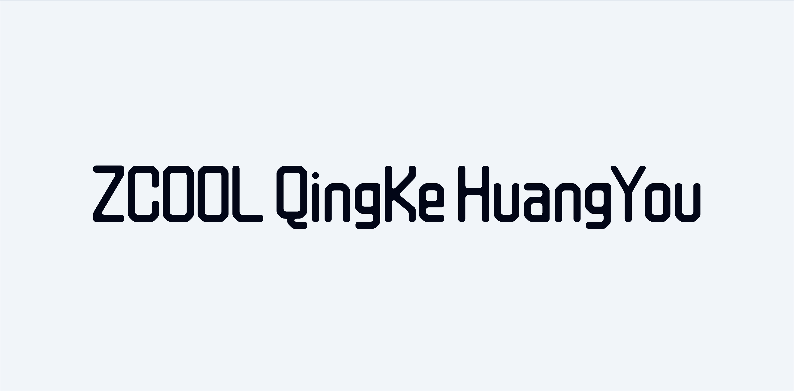

## 10. [ZCOOL QingKe HuangYou](https://fonts.google.com/specimen/ZCOOL+QingKe+HuangYou)

Okay, this one’s a mouthful to say, but it’s awesome. It’s got this futuristic vibe that’s perfect for techy landing pages or anything enterprise-y. If you’re going for that “cutting-edge” look, this is the one.

---

## 9. [Handjet](https://fonts.google.com/specimen/Handjet)

Handjet is super retro and just plain cool. I use it on posters and tech-themed designs. The uppercase letters all being the same height make it stand out—perfect for banners, landing pages, and apps where you want to go bold.

---

## 8. [Shantell Sans](https://fonts.google.com/specimen/Shantell+Sans)

This one’s got personality without being over-the-top. It’s kind of handwritten but polished. I use it for landing pages and banners when I want to add a little warmth. It’s not great for mobile or web apps, but for posters? Gold.

---

## 7. [Just Another Hand](https://fonts.google.com/specimen/Just+Another+Hand)

If you want even more of that handwritten vibe, this is your font. It’s playful and perfect for kid-friendly designs, posters, and banners. Whenever I’m doing something fun or casual, this one’s a lifesaver.

---

## 6. [SN Pro](https://supernotes.app/open-source/sn-pro/)

This one’s a gem. It’s like a friendlier version of Apple’s SF Pro Rounded. SN Pro has this rounded, calming feel—great for anything that needs to look approachable but not childish. Think soft but professional.

---

## 5. [JARO](https://fonts.google.com/specimen/Jaro)

Bold and edgy, JARO is amazing for grabbing attention. I use it for landing pages and posters when I need to emphasize something. It’s versatile—can swing between retro and futuristic depending on the design. Love it for banners too.

---

## 4. [Instrument Serif](https://fonts.google.com/specimen/Instrument+Serif)

Everyone’s using this one lately, and for good reason. It’s got this luxurious, polished look that’s ideal for landing pages. Plus, it’s free on Google Fonts. Can’t argue with style and affordability, right?

---

## 3. [Big Shoulders Display](https://fonts.google.com/specimen/Big+Shoulders+Display)

Big, bold, and perfect for making a statement. I’ve used this in so many posters and landing pages. It commands attention and ensures the message is clear. If you want to shout something loud and proud, this is your font.

---

## 2. [JetBrains Mono](https://fonts.google.com/specimen/JetBrains+Mono)

For web apps and anything involving code or numbers, JetBrains Mono is unbeatable. It’s clean, easy on the eyes, and just feels right. I use it for paragraphs in apps and any place I need that monospaced charm.

---

## 1. [Inter](https://fonts.google.com/specimen/Inter) or [Geist](https://fonts.google.com/specimen/Geist)

I couldn’t pick just one, so here’s a tie! Inter and Geist are my ultimate workhorses. They’re versatile, clean, and just work everywhere—landing pages, apps, you name it. Inter’s been around on Google Fonts forever, and Geist just joined the party. Both are top-notch.

---

So there you have it—my top 10 fonts for UI design. Each one brings something special to the table. If you’ve got favorites I didn’t mention, hit me up. I’m always looking for cool new fonts to try. Let’s keep the font love going!
