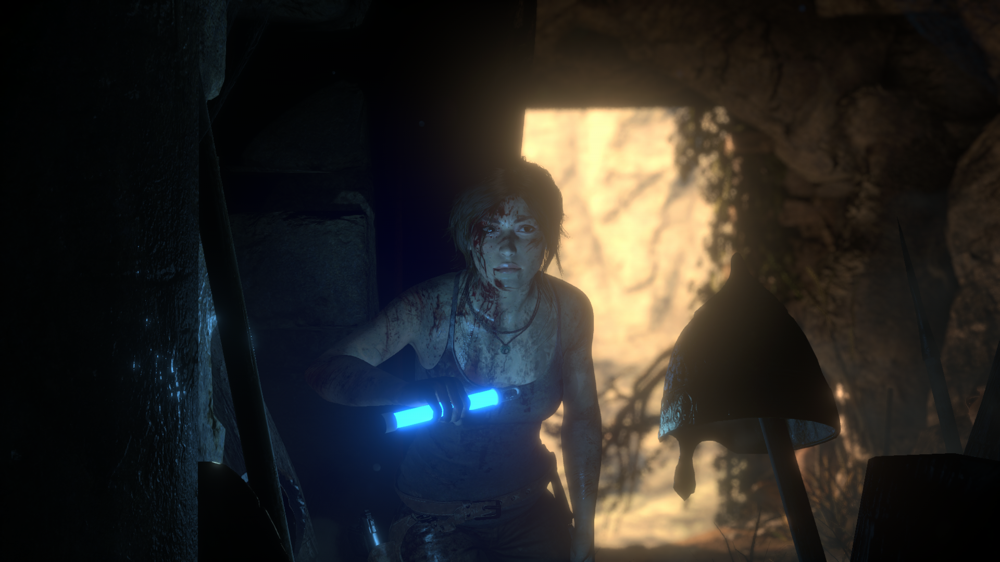
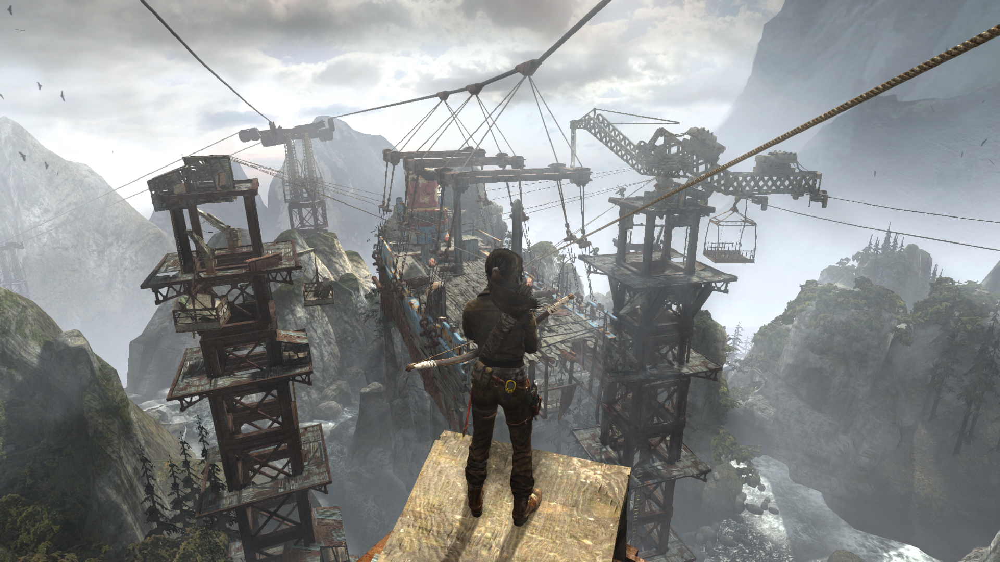
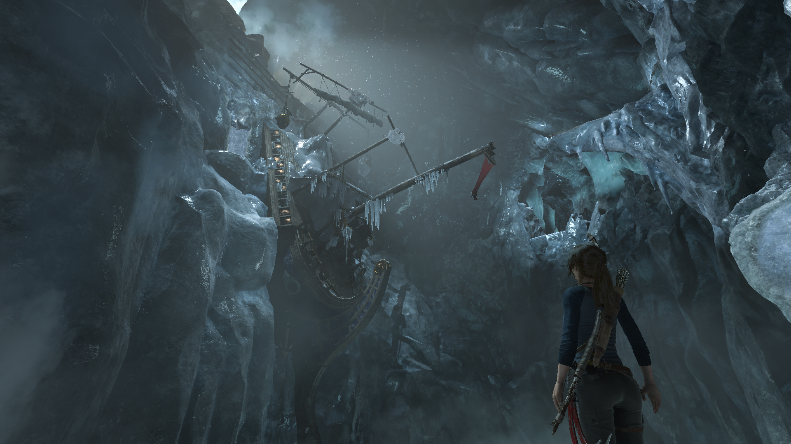
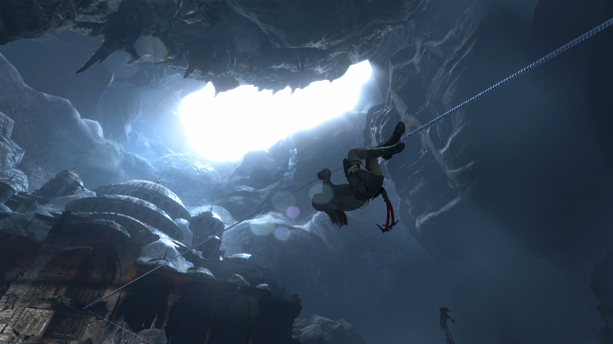
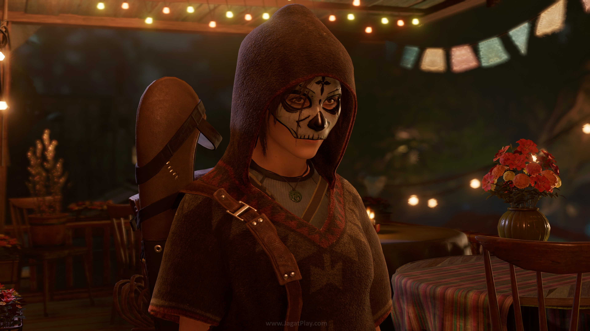
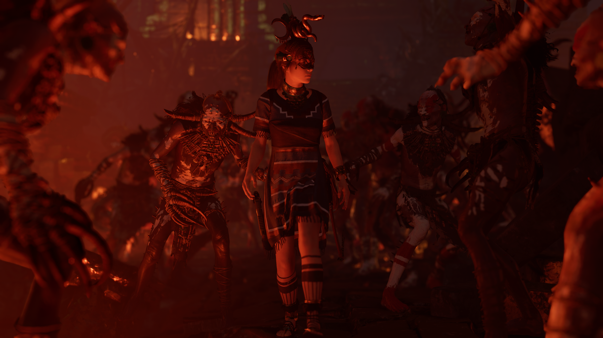
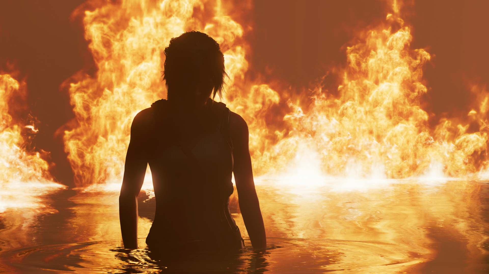
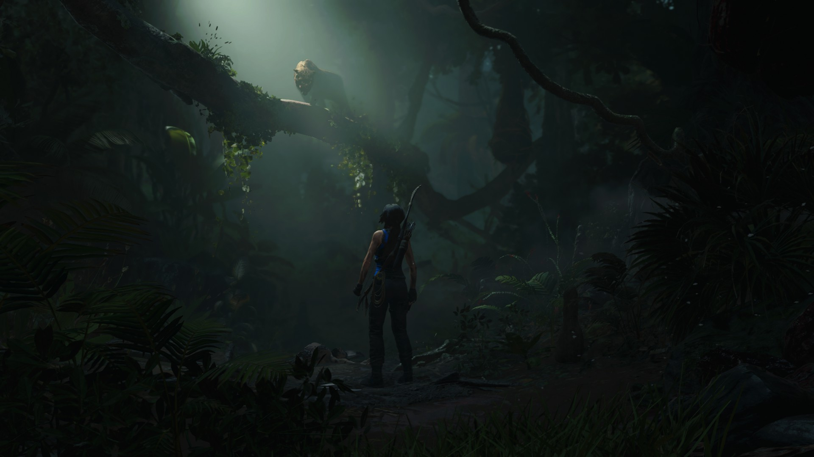

## 1. Tomb Raider (2013): Where It All Begins

Picture this: Lara is young, inexperienced, and stranded on a dangerous island after a shipwreck. You’re thrown into survival mode with her, and honestly? It’s a blast.

**What Makes It Great?**

- **Character Development**: You watch Lara evolve from a scared adventurer into a confident, resourceful survivor. Her growth feels _earned_. You’re with her through every injury, every puzzle, and every fight.
- **Gameplay**: It’s smooth and addictive. You get puzzle-solving, resource gathering, and combat—all balanced perfectly.
- **The World**: The island feels alive. Exploring tombs, scavenging for supplies, and solving mysteries kept me hooked.

One of my favorite moments? Solving my first tomb puzzle after a tough battle—it felt so satisfying.

If you’re new to the series, this game is a perfect entry point. It’s easy to pick up, the story pulls you in, and you’ll finish it wanting more.

---

## 2. Rise of the Tomb Raider (2015): Bigger, Better, and More Confident

Lara’s second outing cranks everything up. The story moves to snowy Siberia, where Lara is on a quest to uncover a lost city. This time, she’s more confident, more skilled, and the stakes are higher.

**What Stands Out?**

- **Mythology and Story**: The game dives into legends and myths in a way that’s both fascinating and cinematic. Lara becomes a true explorer.
- **Stealth and Combat**: While the stealth could be better (some areas felt repetitive), the combat still delivers a solid mix of bow-and-arrow fun and creative takedowns.
- **Graphics**: The snowy landscapes? Breathtaking. The visuals here are a major upgrade.

The game also introduces larger, open environments to explore, which I absolutely loved. There are hidden challenges, side quests, and gorgeous tombs scattered across the world. I remember getting sidetracked for hours just exploring.

If you enjoyed the first game, _Rise_ feels like a natural evolution. It’s bigger, more refined, and adds layers to Lara’s story.

---

## 3. Shadow of the Tomb Raider (2018): The Grand Finale

This is it—the conclusion of Lara’s Survivor arc. _Shadow_ takes you deep into the jungles of South America as Lara faces the Maya apocalypse.

**Why It Works:**

- **The Setting**: The dense jungle environment is both stunning and terrifying. It’s crawling with challenges, hidden secrets, and danger at every turn.
- **Lara’s Journey**: Lara is now fully aware of her responsibilities. She’s a confident leader and adventurer, and this game gives her story the closure it deserves.
- **The Culture**: Exploring Maya and Incan ruins feels authentic and immersive. The developers really went all out on the cultural elements.

That said, I did feel that some gameplay mechanics started to feel repetitive—like solving puzzles that felt _too_ familiar. But by the time I reached the finale, it didn’t matter. Seeing Lara’s transformation come full circle was worth it.

One of my most memorable moments? A stealth section where I had to blend into the environment and take out enemies one by one. It felt like being a _real_ predator in the jungle—so intense!

---

## Why Play the Whole Trilogy?

If you have the time, play all three. Trust me:

- **The Evolution of Lara**: You won’t just play games; you’ll experience a character’s growth from vulnerable survivor to legendary explorer.
- **Great Puzzles and Exploration**: The games balance combat, puzzles, and exploration beautifully. Each game has its own vibe, but they all deliver satisfying moments of discovery.
- **Stunning Graphics**: Whether it’s the eerie island in _Tomb Raider_, the snowy peaks of _Rise_, or the dense jungles of _Shadow_, these games look gorgeous.

---

## Final Thoughts: Start Your Adventure

Sure, there are moments where things feel repetitive—the trilogy doesn’t reinvent the wheel with every installment. But what it does do is offer an engaging story, fun gameplay, and a Lara Croft who feels more _human_ than ever before.

If you haven’t played these games yet, start with the first one. It’s the easiest to get into, and once you’re hooked, you’ll want to see Lara’s journey through to the end. Plus, there’s nothing like the satisfaction of solving a tomb puzzle after hours of exploring—you’ll see what I mean.

So, dive in, and start your own _Tomb Raider_ adventure. You won’t regret it!

